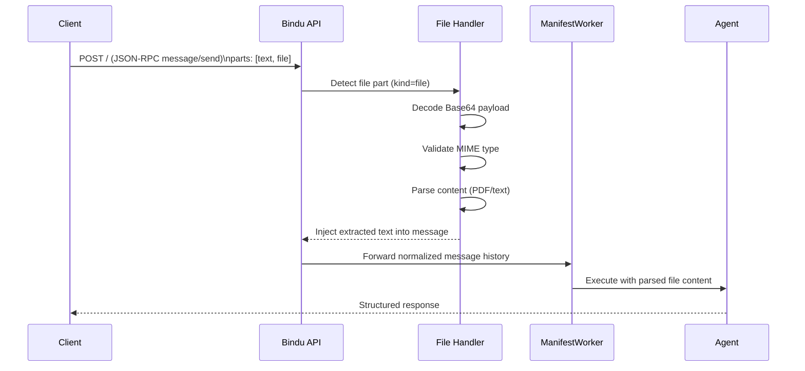

# File Handling & Uploads

Bindu provides built-in file handling at the framework layer, so agent authors do not need to implement custom upload parsing logic. Uploaded files are validated, parsed, and injected into conversation context as plain text before agent execution.

This design gives you:
- Consistent parsing behavior across agents
- Strict MIME-type validation before execution
- Zero-configuration file support for common document workflows

## How It Works



## Supported Formats

Bindu currently supports:
- `application/pdf` (PDF parsing)
- Text MIME types such as `text/plain`, `text/csv`

Unsupported MIME types are rejected before task execution.

## Upload Request Format

Files are sent using A2A JSON-RPC as Base64 data inside a `parts` item with `"kind": "file"`.

```json
{
  "jsonrpc": "2.0",
  "id": "550e8400-e29b-41d4-a716-446655440000",
  "method": "message/send",
  "params": {
    "message": {
      "messageId": "550e8400-e29b-41d4-a716-446655440001",
      "contextId": "550e8400-e29b-41d4-a716-446655440002",
      "taskId": "550e8400-e29b-41d4-a716-446655440003",
      "kind": "message",
      "role": "user",
      "parts": [
        {
          "kind": "text",
          "text": "Please summarize this document."
        },
        {
          "kind": "file",
          "mimeType": "application/pdf",
          "data": "JVBERi0xLjQK...<base64>..."
        }
      ]
    }
  }
}
```

## Processing Pipeline

### 1. Protocol Interception

The message conversion layer detects `"kind": "file"` parts in incoming payloads.

### 2. Extraction and Validation

The file handler decodes Base64 content, validates MIME type, and routes to the parser.

### 3. Context Injection

Parsed content is transformed into a text block and appended to the conversation payload.

Example injected structure:

```text
[Attached Document: file.pdf]
...extracted content...
```

### 4. Agent Execution

`ManifestWorker` receives normalized text content and runs the agent with file data already in message history.

## Developer Experience

### Zero Configuration for Agents

Agent code does not need to handle:
- Base64 decoding
- Binary parsing
- MIME validation

Agents receive clean text content and can immediately summarize, classify, extract, or reason over uploaded documents.

## Security Considerations

- Validate MIME types strictly at the API boundary
- Reject unsupported file formats before task execution
- Avoid passing raw binary payloads to model execution
- Keep parser dependencies updated for security patches

## Tips

- Prefer text-based formats when possible for lower parsing overhead
- Keep user prompts explicit (for example: summarize, extract entities, compare)
- Return clear validation errors for unsupported file types

## Related Documentation

- [Streaming](./STREAMING.md)
- [Storage](./STORAGE.md)
- [Authentication](./AUTHENTICATION.md)
du abstracts file handling into a seamless pipeline:

```text id="u5p9e2"
Upload → Parse → Inject → Consume
```

👉 So you can focus on **agent logic**, not file infrastructure.

---
