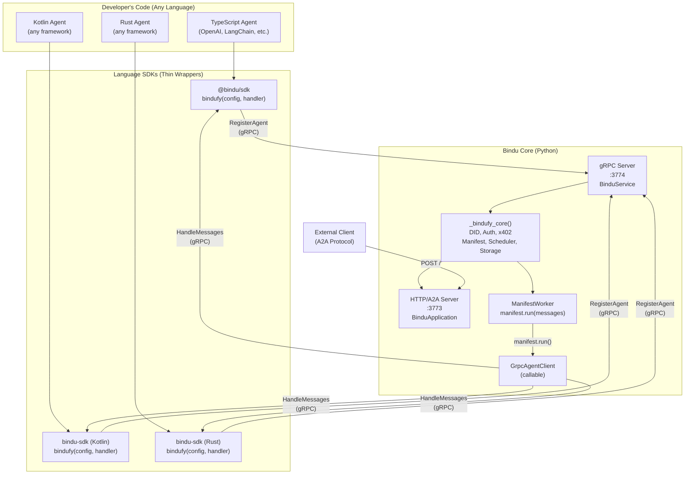
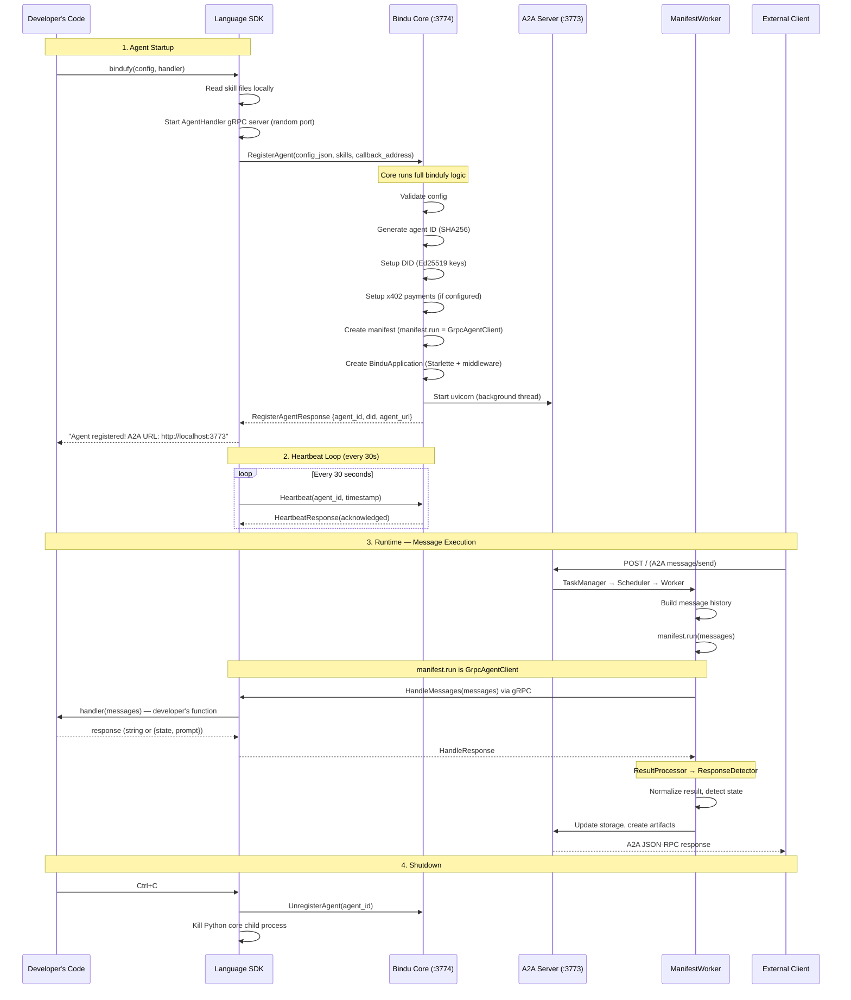
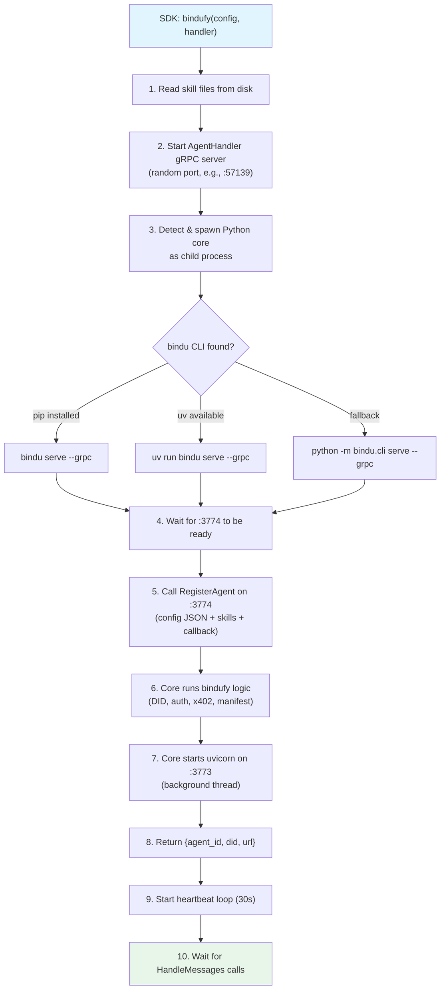

# gRPC Language-Agnostic Agent Support

> **📁 This documentation has been reorganized!**
> The content below is preserved for reference, but the **new structured documentation** is at:
> - **[docs/grpc/](./grpc/)** - Main documentation hub
> - **[docs/grpc/api-reference.md](./grpc/api-reference.md)** - Complete API reference
> - **[docs/grpc/client.md](./grpc/client.md)** - GrpcAgentClient implementation
> - **[docs/grpc/limitations.md](./grpc/limitations.md)** - Known limitations and gaps

---

Bindu's gRPC adapter enables agents written in **any programming language** — TypeScript, Kotlin, Rust, Go, or any language with gRPC support — to transform themselves into full Bindu microservices with DID identity, A2A protocol, x402 payments, scheduling, and storage.

The gRPC layer is the bridge between the language-agnostic developer world and the Python-powered Bindu core. Developers call `bindufy()` from their language SDK, and the gRPC adapter handles everything behind the scenes.

## Architecture Overview



## Two gRPC Services

The gRPC adapter defines **two services** in a single proto file (`proto/agent_handler.proto`):

### 1. BinduService (Core Side — Port 3774)

SDKs call this service on the Bindu core to register agents and manage their lifecycle.

| RPC Method | Direction | Purpose |
|-----------|-----------|---------|
| `RegisterAgent` | SDK → Core | Register an agent with full config, skills, and callback address. Core runs bindufy logic (DID, auth, x402, manifest, HTTP server). |
| `Heartbeat` | SDK → Core | Periodic keep-alive signal (every 30s). Core tracks agent liveness. |
| `UnregisterAgent` | SDK → Core | Disconnect and clean up. Core stops the agent's HTTP server. |

### 2. AgentHandler (SDK Side — Dynamic Port)

The core calls this service on the SDK whenever a task needs to be executed.

| RPC Method | Direction | Purpose |
|-----------|-----------|---------|
| `HandleMessages` | Core → SDK | Execute the developer's handler with conversation history. This is called every time an A2A request arrives. |
| `HandleMessagesStream` | Core → SDK | ⚠️ **NOT IMPLEMENTED** - Defined in proto but `GrpcAgentClient` doesn't support streaming. See [limitations](./grpc/limitations.md). |
| `GetCapabilities` | Core → SDK | Query what the agent supports (skills, streaming, etc.). |
| `HealthCheck` | Core → SDK | Verify the SDK process is responsive. |

## Complete Message Flow



## GrpcAgentClient — The Core Bridge

`GrpcAgentClient` is the key component that makes gRPC transparent to the rest of the Bindu core. It is a **callable class** that replaces `manifest.run` for remote agents.

### How it works

In `ManifestWorker.run_task()` (line 171 of `manifest_worker.py`):

```python
raw_results = self.manifest.run(message_history or [])
```

For a **Python agent**, `manifest.run` is a direct Python function call.

For a **remote agent** (TypeScript, Kotlin, etc.), `manifest.run` is a `GrpcAgentClient` instance. When called, it:

1. Converts `list[dict[str, str]]` → proto `ChatMessage` objects
2. Calls `AgentHandler.HandleMessages` on the SDK via gRPC
3. Converts the proto `HandleResponse` back to `str` or `dict`
4. Returns the result to ManifestWorker

### Response format contract

The GrpcAgentClient returns exactly what `ResultProcessor` and `ResponseDetector` expect:

| SDK returns | GrpcAgentClient returns | Task state |
|------------|------------------------|------------|
| Plain string (`"Hello"`) | `str` → `"Hello"` | `completed` |
| `{state: "input-required", prompt: "Clarify?"}` | `dict` → `{"state": "input-required", "prompt": "Clarify?"}` | `input-required` |
| `{state: "auth-required"}` | `dict` → `{"state": "auth-required"}` | `auth-required` |

This means **zero changes** to ManifestWorker, ResultProcessor, ResponseDetector, or any downstream component. They cannot tell the difference between a local Python handler and a remote gRPC handler.

## Proto Definition

The full proto file is at `proto/agent_handler.proto`. Key design decisions:

### Config sent as JSON

```protobuf
message RegisterAgentRequest {
  string config_json = 1;  // Full config as JSON string
  repeated SkillDefinition skills = 2;
  string grpc_callback_address = 3;
}
```

The config is sent as a JSON string rather than typed proto fields. This means:
- Adding new config fields to `bindufy()` does **not** require proto changes
- Config validation happens once, in the Python core (`ConfigValidator`)
- SDKs define their own typed config interfaces that serialize to JSON
- **DRY principle**: config schema lives in one place (Python)

### Skills sent with content

```protobuf
message SkillDefinition {
  string name = 1;
  string description = 2;
  repeated string tags = 3;
  string raw_content = 8;  // Full skill.yaml/SKILL.md content
  string format = 9;       // "yaml" or "markdown"
}
```

The SDK reads skill files from the developer's filesystem and sends the content in the proto. The core processes skills without needing filesystem access to the SDK's project directory.

### Response state handling

```protobuf
message HandleResponse {
  string content = 1;
  string state = 2;    // "", "input-required", "auth-required"
  string prompt = 3;
  bool is_final = 4;
  map<string, string> metadata = 5;
}
```

When `state` is empty, the response is a normal completion. When `state` is set, it triggers a task state transition — the task stays open for follow-up messages.

## SDK Developer Experience

The gRPC layer is completely invisible to the developer. All SDKs expose the same `bindufy(config, handler)` function:

### TypeScript

```typescript
import { bindufy, ChatMessage } from "@bindu/sdk";
import OpenAI from "openai";

const openai = new OpenAI();

bindufy({
  author: "dev@example.com",
  name: "my-agent",
  deployment: { url: "http://localhost:3773", expose: true },
  skills: ["skills/question-answering"],
}, async (messages: ChatMessage[]) => {
  const response = await openai.chat.completions.create({
    model: "gpt-4o",
    messages: messages.map(m => ({
      role: m.role as "user" | "assistant" | "system",
      content: m.content,
    })),
  });
  return response.choices[0].message.content || "";
});
```

### Kotlin

```kotlin
import com.getbindu.sdk.bindufy

fun main() {
    bindufy(
        config = mapOf(
            "author" to "dev@example.com",
            "name" to "my-agent",
            "deployment" to mapOf("url" to "http://localhost:3773"),
        )
    ) { messages ->
        "Echo: ${messages.last().content}"
    }
}
```

### Python (unchanged)

```python
from bindu.penguin.bindufy import bindufy

def handler(messages):
    return my_agent.run(messages)

bindufy(config, handler)  # No gRPC — direct in-process call
```

## SDK Internal Flow

When a developer calls `bindufy()` from a language SDK, this is what happens inside:



## Configuration

### Environment Variables

| Variable | Default | Description |
|----------|---------|-------------|
| `GRPC__ENABLED` | `false` | Enable gRPC server (set automatically by `bindu serve --grpc`) |
| `GRPC__HOST` | `0.0.0.0` | gRPC server bind host |
| `GRPC__PORT` | `3774` | gRPC server port |
| `GRPC__MAX_WORKERS` | `10` | Thread pool size for gRPC server |
| `GRPC__MAX_MESSAGE_LENGTH` | `4194304` | Max gRPC message size (4MB) |
| `GRPC__HANDLER_TIMEOUT` | `30.0` | Timeout for HandleMessages calls (seconds) |
| `GRPC__HEALTH_CHECK_INTERVAL` | `30` | Health check interval (seconds) |

### Python Settings

```python
from bindu.settings import app_settings

# Access gRPC settings
app_settings.grpc.enabled     # bool
app_settings.grpc.host         # str
app_settings.grpc.port         # int
app_settings.grpc.max_workers  # int
```

## Port Layout

```
Bindu Core Process
├── :3773  Uvicorn (HTTP)  — A2A protocol, agent card, DID, health, x402, metrics
└── :3774  gRPC Server     — RegisterAgent, Heartbeat, UnregisterAgent

SDK Process
└── :XXXXX  gRPC Server (dynamic port) — HandleMessages, GetCapabilities, HealthCheck
```

## Agent Registry

The core maintains a thread-safe in-memory registry of connected SDK agents:

```python
from bindu.grpc.registry import AgentRegistry

registry = AgentRegistry()

# After RegisterAgent
registry.register(agent_id, callback_address, manifest)

# Lookup
entry = registry.get(agent_id)
# entry.agent_id, entry.grpc_callback_address, entry.manifest,
# entry.registered_at, entry.last_heartbeat

# Heartbeat update
registry.update_heartbeat(agent_id)

# List all connected agents
agents = registry.list_agents()

# Cleanup
registry.unregister(agent_id)
```

## Testing gRPC

### Prerequisites

Start the Bindu core with gRPC enabled:

```bash
cd /path/to/Bindu
uv run bindu serve --grpc
```

You should see:

```
INFO  gRPC server started on 0.0.0.0:3774
INFO  Waiting for SDK agent registrations...
```

Leave this terminal running. Open a new terminal for the tests below.

### Option A: Testing with grpcurl (Command Line)

Install grpcurl:

```bash
brew install grpcurl
```

#### 1. List available services

```bash
grpcurl -plaintext \
  -import-path /path/to/Bindu/proto \
  -proto agent_handler.proto \
  localhost:3774 list
```

**Expected output:**

```
bindu.grpc.AgentHandler
bindu.grpc.BinduService
```

#### 2. List methods in BinduService

```bash
grpcurl -plaintext \
  -import-path /path/to/Bindu/proto \
  -proto agent_handler.proto \
  localhost:3774 list bindu.grpc.BinduService
```

**Expected output:**

```
bindu.grpc.BinduService.Heartbeat
bindu.grpc.BinduService.RegisterAgent
bindu.grpc.BinduService.UnregisterAgent
```

#### 3. Test Heartbeat

```bash
grpcurl -plaintext -emit-defaults \
  -proto '/path/to/Bindu/proto/agent_handler.proto' \
  -import-path '/path/to/Bindu/proto' \
  -d '{"agent_id": "test-123", "timestamp": 1711234567890}' \
  'localhost:3774' \
  bindu.grpc.BinduService.Heartbeat
```

**Expected response:**

```json
{
  "acknowledged": false,
  "server_timestamp": "1774280770851"
}
```

`acknowledged: false` is correct — no agent with ID "test-123" is registered yet. The response confirms the gRPC server is alive and processing requests.

#### 4. Test RegisterAgent (Full bindufy over gRPC)

```bash
grpcurl -plaintext -emit-defaults \
  -proto '/path/to/Bindu/proto/agent_handler.proto' \
  -import-path '/path/to/Bindu/proto' \
  -d '{
    "config_json": "{\"author\":\"test@example.com\",\"name\":\"grpc-test-agent\",\"description\":\"Testing gRPC registration\",\"deployment\":{\"url\":\"http://localhost:3773\",\"expose\":true}}",
    "skills": [],
    "grpc_callback_address": "localhost:50052"
  }' \
  'localhost:3774' \
  bindu.grpc.BinduService.RegisterAgent
```

**Expected response:**

```json
{
  "success": true,
  "agentId": "91547067-c183-e0fd-c150-27a3ca4135ed",
  "did": "did:bindu:test_at_example_com:grpc-test-agent:91547067-c183-e0fd-c150-27a3ca4135ed",
  "agentUrl": "http://localhost:3773",
  "error": ""
}
```

This confirms the **full bindufy flow** ran successfully over gRPC:

| Step | Status |
|------|--------|
| Config validation | ✅ Passed |
| Agent ID generation (SHA256 of author+name) | ✅ `91547067...` |
| DID creation (Ed25519 keys) | ✅ `did:bindu:test_at_example_com:...` |
| Manifest creation with GrpcAgentClient | ✅ Handler points to `localhost:50052` |
| A2A HTTP server started | ✅ Running on `http://localhost:3773` |

#### 5. Verify the A2A server is alive

After a successful RegisterAgent, verify the HTTP server is running:

```bash
curl -s http://localhost:3773/.well-known/agent.json | python3 -m json.tool
```

**Expected:** Full agent card with DID, skills, capabilities — identical to a Python-bindufied agent.

#### 6. Test Heartbeat again (now with registered agent)

```bash
grpcurl -plaintext -emit-defaults \
  -proto '/path/to/Bindu/proto/agent_handler.proto' \
  -import-path '/path/to/Bindu/proto' \
  -d '{"agent_id": "91547067-c183-e0fd-c150-27a3ca4135ed", "timestamp": 1711234567890}' \
  'localhost:3774' \
  bindu.grpc.BinduService.Heartbeat
```

**Expected response:**

```json
{
  "acknowledged": true,
  "server_timestamp": "1774280800000"
}
```

`acknowledged: true` — the agent is registered and the heartbeat was recorded.

#### 7. Test UnregisterAgent

```bash
grpcurl -plaintext -emit-defaults \
  -proto '/path/to/Bindu/proto/agent_handler.proto' \
  -import-path '/path/to/Bindu/proto' \
  -d '{"agent_id": "91547067-c183-e0fd-c150-27a3ca4135ed"}' \
  'localhost:3774' \
  bindu.grpc.BinduService.UnregisterAgent
```

#### 8. Clean up ports

```bash
lsof -ti:3773 -ti:3774 | xargs kill 2>/dev/null
```

### Option B: Testing with Postman

#### Setup

1. Open Postman
2. Click **+** (new tab) → change the dropdown from **HTTP** to **gRPC**
3. Enter URL: `localhost:3774`
4. Click **Import .proto file** → select `proto/agent_handler.proto`
5. The method dropdown will show all available RPCs

#### Test Heartbeat

1. Select method: `bindu.grpc.BinduService/Heartbeat`
2. In the **Message** tab, paste:

```json
{
  "agent_id": "test-123",
  "timestamp": 1711234567890
}
```

3. Click **Invoke**
4. Verify response shows `acknowledged` and `server_timestamp`

#### Test RegisterAgent

1. Select method: `bindu.grpc.BinduService/RegisterAgent`
2. In the **Message** tab, paste:

```json
{
  "config_json": "{\"author\":\"test@example.com\",\"name\":\"postman-agent\",\"description\":\"Testing from Postman\",\"deployment\":{\"url\":\"http://localhost:3773\",\"expose\":true}}",
  "skills": [],
  "grpc_callback_address": "localhost:50052"
}
```

3. Click **Invoke**
4. Verify response shows `success: true` with `agentId`, `did`, and `agentUrl`

#### Save to Collection

Click **Save** → create collection `Bindu gRPC` → save each method as a separate request.

> **Note:** `curl` does not work with gRPC. gRPC uses HTTP/2 with binary protobuf encoding. Use `grpcurl` or Postman's gRPC tab instead.

### Option C: Testing with Python unit tests

```bash
cd /path/to/Bindu
uv run pytest tests/unit/grpc/ -v
```

This runs all gRPC unit tests including GrpcAgentClient, AgentRegistry, and BinduServiceImpl.

## Proto Generation

### What is the `generated/` folder?

The `bindu/grpc/generated/` folder contains auto-generated Python code from the proto definition. These files are created by the protobuf compiler (`protoc`) and should **never be edited by hand**.

| Generated file | Purpose |
|---------------|---------|
| `agent_handler_pb2.py` | Python classes for all proto messages — `ChatMessage`, `HandleRequest`, `HandleResponse`, `RegisterAgentRequest`, etc. These are the serialization/deserialization layer. |
| `agent_handler_pb2_grpc.py` | gRPC server base classes (`BinduServiceServicer`, `AgentHandlerServicer`) and client stubs (`BinduServiceStub`, `AgentHandlerStub`). The core's `service.py` extends the servicers, and `client.py` uses the stubs. |
| `agent_handler_pb2.pyi` | Type hints (`.pyi` stub file) so IDEs provide autocomplete and type checking for the generated classes. |

### How to regenerate

If you modify `proto/agent_handler.proto`, regenerate the stubs:

```bash
cd /path/to/Bindu
bash scripts/generate_protos.sh python
```

Or manually:

```bash
uv run python -m grpc_tools.protoc \
  -I proto \
  --python_out=bindu/grpc/generated \
  --grpc_python_out=bindu/grpc/generated \
  --pyi_out=bindu/grpc/generated \
  proto/agent_handler.proto
```

### Generate for all languages

```bash
# Python + TypeScript
bash scripts/generate_protos.sh python
bash scripts/generate_protos.sh typescript

# Or all at once
bash scripts/generate_protos.sh all
```

Kotlin stubs are generated automatically by the Gradle protobuf plugin during `./gradlew build`.

### How the generated code is used

```python
# In bindu/grpc/client.py (GrpcAgentClient)
from bindu.grpc.generated.agent_handler_pb2 import ChatMessage, HandleRequest
from bindu.grpc.generated.agent_handler_pb2_grpc import AgentHandlerStub

# Convert Python dicts → proto messages
proto_msgs = [ChatMessage(role=m["role"], content=m["content"]) for m in messages]
request = HandleRequest(messages=proto_msgs)

# Make gRPC call using generated stub
response = self._stub.HandleMessages(request, timeout=30.0)
```

```python
# In bindu/grpc/service.py (BinduServiceImpl)
from bindu.grpc.generated.agent_handler_pb2 import RegisterAgentResponse
from bindu.grpc.generated.agent_handler_pb2_grpc import BinduServiceServicer

class BinduServiceImpl(BinduServiceServicer):
    def RegisterAgent(self, request, context):
        # request is a generated RegisterAgentRequest class
        config = json.loads(request.config_json)
        # ... run bindufy logic ...
        return RegisterAgentResponse(success=True, agent_id=str(agent_id), ...)
```

### The flow

```
proto/agent_handler.proto          (single source of truth)
        │
        │  protoc compiler
        ▼
bindu/grpc/generated/              (auto-generated, never edit)
  ├── agent_handler_pb2.py         → message classes
  ├── agent_handler_pb2_grpc.py    → server/client stubs
  └── agent_handler_pb2.pyi        → type hints
        │
        │  imported by
        ▼
bindu/grpc/
  ├── client.py                    → uses AgentHandlerStub
  ├── service.py                   → extends BinduServiceServicer
  └── server.py                    → uses add_BinduServiceServicer_to_server
```

> **Important:** The `generated/` folder is committed to git so that users don't need `grpcio-tools` installed just to use Bindu. Only contributors who modify the proto need the generation tools.

## File Structure

```
proto/
  agent_handler.proto              # Single source of truth for the gRPC contract

bindu/grpc/
  __init__.py                      # Package exports
  generated/                       # protoc output (Python stubs)
    agent_handler_pb2.py
    agent_handler_pb2_grpc.py
    agent_handler_pb2.pyi
  client.py                        # GrpcAgentClient (core → SDK callable)
  server.py                        # gRPC server startup
  service.py                       # BinduServiceImpl (handles RegisterAgent)
  registry.py                      # Thread-safe agent registry

bindu/cli/
  __init__.py                      # `bindu serve --grpc` command

sdks/
  typescript/                      # @bindu/sdk npm package
    src/
      index.ts                     # bindufy() function
      server.ts                    # AgentHandler gRPC server
      client.ts                    # BinduService gRPC client
      core-launcher.ts             # Spawns Python core as child process
      types.ts                     # TypeScript interfaces
    proto/
      agent_handler.proto          # Copy of proto for npm packaging

  kotlin/                          # bindu-sdk Gradle package
    src/main/kotlin/com/getbindu/sdk/
      BinduAgent.kt                # bindufy() function
      Server.kt                    # AgentHandler gRPC server
      Client.kt                    # BinduService gRPC client
      CoreLauncher.kt              # Spawns Python core as child process

scripts/
  generate_protos.sh               # Generates stubs for all languages
```

## Extending to New Languages

To add support for a new language (e.g., Go, Rust, Swift):

1. **Generate stubs** from `proto/agent_handler.proto` using the language's protoc plugin
2. **Implement AgentHandler service** — receives `HandleMessages` calls, invokes the developer's handler
3. **Implement BinduService client** — calls `RegisterAgent` on core port 3774
4. **Implement CoreLauncher** — spawns `bindu serve --grpc` as a child process
5. **Expose `bindufy(config, handler)`** — the developer-facing API

The SDK should be ~200-400 lines. The proto contract is the single source of truth — as long as the SDK speaks the same proto, it works with any version of the Bindu core.

## Testing

### Test Pyramid

```
        ┌─────────────┐
        │   E2E Tests  │  tests/integration/grpc/  — real servers, real ports
        │  (5 tests)   │  Run: uv run pytest tests/integration/grpc/ -v -m e2e
        ├──────────────┤
        │  Unit Tests  │  tests/unit/grpc/  — mocked, hermetic, fast
        │ (40+ tests)  │  Run: uv run pytest tests/unit/grpc/ -v
        └──────────────┘
```

### Unit Tests (in pre-commit, every commit)

Fast, hermetic, no network ports. All gRPC calls are mocked.

```bash
uv run pytest tests/unit/grpc/ -v
```

| Test file | What it covers |
|-----------|---------------|
| `test_client.py` | GrpcAgentClient — unary, streaming, health check, capabilities, connection lifecycle |
| `test_registry.py` | AgentRegistry — register, unregister, heartbeat, thread safety |
| `test_service.py` | BinduServiceImpl — RegisterAgent, config conversion, error handling |

### E2E Integration Tests (in CI, every PR)

Full round-trip with real gRPC and HTTP servers on non-standard ports (13773, 13774, 13999) to avoid conflicts.

```bash
uv run pytest tests/integration/grpc/ -v -m e2e
```

| Test | What it proves |
|------|---------------|
| `test_heartbeat_unregistered` | gRPC server starts, accepts requests |
| `test_register_agent` | Full bindufy flow over gRPC — DID, manifest, HTTP server |
| `test_heartbeat_registered` | Heartbeat acknowledged for registered agents |
| `test_agent_card_available` | A2A agent card served with DID extension after registration |
| `test_send_message_and_get_response` | **Full round-trip**: A2A HTTP → TaskManager → Scheduler → Worker → GrpcAgentClient → Mock AgentHandler → response with DID signature |
| `test_health_endpoint` | /health endpoint works on registered agent's server |

The E2E tests use a `MockAgentHandler` that simulates what a TypeScript or Kotlin SDK does — receives `HandleMessages` calls and returns echo responses.

### CI Pipeline

The CI workflow (`.github/workflows/ci.yml`) runs on every PR to main:

```
┌──────────────────┐     ┌──────────────────┐     ┌──────────────────┐
│   Unit Tests     │     │  E2E gRPC Tests  │     │  TypeScript SDK  │
│  Python 3.12+    │────►│  Real servers    │     │  Build verify    │
│  Pre-commit      │     │  Full round-trip │     │  npm install     │
│  Coverage ≥60%   │     │                  │     │  npm run build   │
└──────────────────┘     └──────────────────┘     └──────────────────┘
```

- **Unit tests** run on Python 3.12 and 3.13 in parallel
- **E2E tests** run after unit tests pass (real gRPC + HTTP servers)
- **TypeScript SDK** build verification runs in parallel

### Running All Tests Locally

```bash
# Unit tests only (fast, ~7s)
uv run pytest tests/unit/ -v

# E2E tests only (needs ports, ~10s)
uv run pytest tests/integration/grpc/ -v -m e2e

# Everything
uv run pytest tests/ -v

# With coverage
uv run pytest tests/ --cov=bindu --cov-report=term-missing
```

## Backward Compatibility

- **Python agents are unaffected.** `bindufy(config, handler)` works exactly as before — no gRPC, no second process, direct in-process handler call.
- **gRPC is opt-in.** The gRPC server only starts when `bindu serve --grpc` is called or when a language SDK spawns the core.
- **Proto evolution.** The proto uses proto3 with optional fields. New fields can be added without breaking existing SDKs. Field numbers are never reused.
