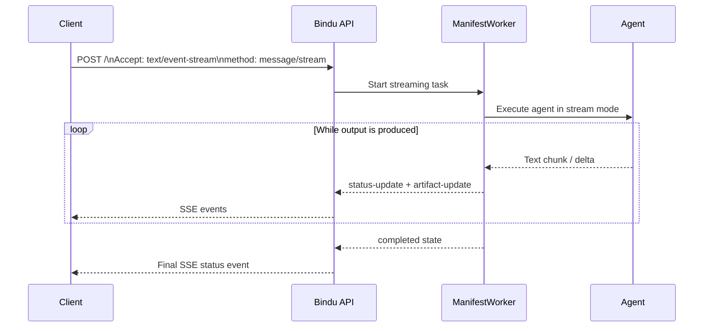

# Streaming

Bindu supports real-time response streaming over Server-Sent Events (SSE) using A2A JSON-RPC. Instead of waiting for full completion, clients can receive incremental text chunks and task state updates as the agent runs.

## How It Works



## API Protocol

Use:
- Endpoint: `POST /`
- Protocol: JSON-RPC 2.0
- Method: `message/stream`
- Transport: `text/event-stream`

### Required Headers

```http
Content-Type: application/json
Accept: text/event-stream
```

## Streaming Request Example

```bash
curl -N -X POST http://localhost:3773/ \
-H "Content-Type: application/json" \
-H "Accept: text/event-stream" \
-d '{
  "jsonrpc": "2.0",
  "id": "550e8400-e29b-41d4-a716-446655440000",
  "method": "message/stream",
  "params": {
    "message": {
      "messageId": "550e8400-e29b-41d4-a716-446655440001",
      "contextId": "550e8400-e29b-41d4-a716-446655440002",
      "taskId": "550e8400-e29b-41d4-a716-446655440003",
      "kind": "message",
      "role": "user",
      "parts": [
        {
          "kind": "text",
          "text": "Count to 10 slowly."
        }
      ]
    },
    "configuration": {
      "acceptedOutputModes": ["text/event-stream"]
    }
  }
}'
```

## Agent Configuration

The agent handler must emit incremental output (generator/async generator) so the worker can forward chunks over SSE.

```python
async def handler(messages):
    response_stream = agent.run(input=messages, stream=True)

    for chunk in response_stream:
        if chunk.content:
            yield chunk.content
```

## Stream Event Behavior

Clients typically receive:
- `status-update` events for lifecycle transitions
- `artifact-update` events for streamed output content

Common states include:
- `working`
- `input-required`
- `completed`

## Known Caveats

When upstream LLM providers enforce structured JSON output, streaming granularity may degrade from token-level to larger buffered chunks.

This is expected provider behavior. The Bindu SSE pipeline remains functional, but chunk frequency can change.

## Troubleshooting

- If no events arrive, confirm `Accept: text/event-stream` is present
- If response is non-streaming, verify method is `message/stream`
- If chunks are delayed, inspect model/provider settings for JSON schema enforcement
- If stream closes early, validate agent handler yields data and does not return a single buffered string

## Related Documentation

- [File Handling & Uploads](./FILE_HANDLING_&_UPLOADS.md)
- [Storage](./STORAGE.md)
- [Authentication](./AUTHENTICATION.md)
